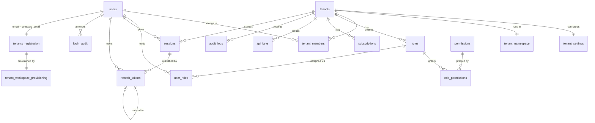

# Post-registration tenant provisioning

How a verified registration becomes a fully provisioned tenant, and how that tenant's owner then
signs in. Implements `tenants.md`.

## Contents

- [The shape of the problem](#the-shape-of-the-problem)
- [Flow](#flow)
- [Why the pipeline is idempotent](#why-the-pipeline-is-idempotent)
- [Schema](#schema)
- [Services](#services)
- [Authentication](#authentication)
- [Production considerations](#production-considerations)
- [Known gaps](#known-gaps)

## The shape of the problem

Registration ends with a verified email, a password, and an account name. Turning that into a
working tenant means creating a dozen related records and one Kubernetes namespace. Those two
halves have nothing in common operationally:

| | Database work | EKS namespace |
|---|---|---|
| Cost | ~1 ms | seconds |
| Failure mode | constraint violation (deterministic) | network/API outage (transient) |
| Retry semantics | must not duplicate | naturally idempotent |
| Availability | same as the service | independent third party |

Running both inside `OnboardingService.register()` would hold a pooled connection open across
multi-second AWS calls and let an EKS outage roll back an account the user was already told exists.
Running both in one background transaction would mean an EKS failure replays the RBAC seed and
duplicates fifty permission grants on every attempt.

So provisioning is a **durable, resumable pipeline**: registration commits a job row and returns;
a worker walks the job through ordered steps, persisting how far it got.

## Flow

```mermaid
sequenceDiagram
    autonumber
    participant C as Client
    participant API as OnboardingRestController
    participant Reg as OnboardingService
    participant DB as Postgres
    participant W as Provisioning worker
    participant EKS as EKS / Kubernetes
    participant M as SMTP

    C->>API: POST /onboarding/account-registration
    API->>Reg: register(command)

    rect rgb(238, 246, 255)
    note over Reg,DB: one transaction — all or nothing
    Reg->>DB: INSERT tenants_registration (staged bcrypt hash)
    note right of DB: no user_id column — users.email<br/>is UNIQUE and equals company_email
    Reg->>DB: INSERT tenant_workspace_provisioning (CREATE_USER)
    Reg->>DB: UPDATE onboarding SET status = COMPLETED
    end

    Reg-->>API: TenantsRegistration
    API-->>C: 201 { provisioningId, workspaceStatus }

    Reg-)W: TenantWorkspaceRequestedEvent (AFTER_COMMIT, async)
    note right of W: @Scheduled poller is the<br/>fallback for retries and<br/>orphaned jobs

    W->>DB: claim: SELECT … FOR UPDATE SKIP LOCKED
    W->>DB: 1 CREATE_USER — users; consumes staged hash
    W->>DB: 2 CREATE_TENANT — tenants + tenant_settings
    W->>DB: 3 SEED_RBAC — 5 roles + grants
    W->>DB: 4 CREATE_MEMBERSHIP — owner + user_roles
    W->>DB: 5 CREATE_SUBSCRIPTION — free trial
    W->>DB: 6 CREATE_API_KEY — internal key (hash only)
    W->>EKS: 7 CREATE_NAMESPACE — serverSideApply
    W->>M: 8 SEND_CONFIRMATION
    W->>DB: status = WORKSPACE_READY

    loop until READY or FAILED
        C->>API: GET /onboarding/workspace-status/{provisioningId}
        API-->>C: { status, namespace }
    end

    C->>API: POST /tenant-auth/login
    API->>DB: session + refresh_token + login_audit
    API-->>C: 200 access JWT + refresh cookie
```

## Why the pipeline is idempotent

`tenants.md` asks for a workflow that is "idempotent and safe against retries". That is achieved
structurally rather than defensively — no step contains a "have I already run?" check.

**Each database step does its work and advances `current_step` in the same transaction**
(`AbstractTransactionalStep`). The consequences:

- A step that fails rolls back its work *and* the advance. The retry re-enters a step that left no
  trace of its previous attempt, so it cannot duplicate rows or emit a second audit event.
- A step that succeeds is never re-run, because `current_step` has moved past it. An EKS outage at
  step 7 retries only step 7 — `users`, `tenants`, `roles`, and `audit_logs` row counts stay flat
  no matter how many attempts it takes.

`CREATE_NAMESPACE` follows the same contract as the database steps — it extends
`AbstractTransactionalStep`, so the `tenant_namespace` row it writes, its audit entry and the
advance all commit together. It buys that at the cost of holding a pooled connection across the EKS
call, which is acceptable only because the work either side of the commit is genuinely idempotent:
`serverSideApply` re-applies an identical namespace harmlessly, and `tenant_namespace` is keyed on
`tenant_id`, so a retry upserts rather than duplicates.

`SEND_CONFIRMATION` is the real exception. It implements `TenantProvisioningStep` directly and
advances through `TenantWorkspaceProvisioningStore.advance()` in a separate transaction, because an
SMTP send cannot be rolled back. A crash in the gap costs a duplicate confirmation email, which is
cosmetic rather than a correctness problem.

Three further guards make double-provisioning impossible even if a job were somehow claimed twice:

| Constraint | Prevents |
|---|---|
| `tenant_workspace_provisioning.company_email UNIQUE` | two jobs for one tenant |
| `tenant_members (tenant_id, user_id) UNIQUE` | a duplicate owner membership |
| `uq_subscriptions_live` partial index | a second live subscription |

And the claim itself — `SELECT … FOR UPDATE SKIP LOCKED` — means concurrent workers step over each
other's locked rows rather than contending for them.

## Schema



### Why each table exists

**`users`** — Identity, split out of `tenants_registration`. That table is the *onboarding funnel*
record: it is keyed on `company_email` and exists to track a signup in progress. A user is a
different thing — it outlives any one tenant and may eventually belong to several — so it gets a
surrogate UUID rather than a natural email key. V3 migrated the bcrypt hash here and dropped
`tenants_registration.password`, leaving exactly one place a credential lives at rest. (V4 re-added
`tenants_registration.password_hash` as a transient staging column for the `CREATE_USER` step —
written by registration, consumed and nulled by the step, never a store.)

The registration carries **no `user_id`**. `users.email` is `UNIQUE` and is always the
registration's `company_email`, so a foreign key would have duplicated a relationship the schema
already guarantees — and given the pipeline a second thing to keep in step. Provisioning resolves
the user through `AbstractTransactionalStep.requireUserId()`, which looks it up by email and fails
loudly if `CREATE_USER` has not run. (V5 dropped the column.)

**`tenants`** — The tenant root. `slug` is `UNIQUE` and capped at 63 characters so it is a valid
RFC 1123 DNS label and can be used verbatim as the Kubernetes namespace suffix (`tenant-<slug>`).
That uniqueness is load-bearing: before this change, `TenantWorkspaceInitialization` sanitized the
free-text account name at provisioning time, so two tenants both called "Acme" silently targeted
the same namespace. Generating the slug once, checking it against `existsBySlug`, and persisting it
makes the namespace collision-free by construction.

**`tenant_settings`** — 1:1 with `tenants`, keyed on `tenant_id`. Split off because settings are
read-modify-write per tenant while `tenants` rows are near-immutable; separating them keeps the hot
row small. The PK choice also makes the step that creates it idempotent for free.

**`tenant_namespace`** (V6) — 1:1 with `tenants`, keyed on `tenant_id`, holding the namespace name
plus the cluster it was applied to (name, endpoint, region) and when. Written by
`CreateNamespaceStep`. It exists because `tenant_workspace_provisioning.namespace` was the only
record of a provisioned workspace, and that is a column on a *queue* row: the job is claimed,
retried and eventually irrelevant, whereas "this tenant is on namespace X of cluster Y" is a durable
fact about the tenant. The old column also named no cluster at all, so a second EKS cluster — or a
replaced one — would leave existing tenants unlocatable. `namespace` is `UNIQUE` for the same reason
`tenants.slug` is: two tenants sharing a namespace is a cross-tenant leak, not a duplicate row. The
cluster columns are nullable because only the live EKS path knows them.

**`tenant_members`** — Membership has its own lifecycle (`INVITED → ACTIVE → SUSPENDED → REMOVED`)
independent of both the user and the tenant, so it is a table rather than a column on either. This
is also the join a user's tenant list comes from at login.

**`roles`** — Tenant-scoped, per the spec. Each tenant gets its own five system rows, so a tenant
can rename them or add custom roles without affecting anyone else. `UNIQUE (tenant_id, name)`.

**`permissions`** — Deliberately **global**, not tenant-scoped. Permissions are a fixed
`resource:action` vocabulary defined by the application (10 resources × 5 actions = 50 rows),
identical for every tenant. Copying them per tenant would multiply the catalog by the tenant count
for no benefit. Tenancy lives in `roles`; this is the vocabulary roles draw from. Seeded once by
the V3 migration with `ON CONFLICT DO NOTHING`.

**`role_permissions`** — The grant join. Composite PK `(role_id, permission_id)` rather than a
surrogate id, so re-running the RBAC seed can only conflict, never silently duplicate.

**`user_roles`** — Role assignment. Carries `tenant_id` even though it is reachable through
`roles`, so "what may this user do in this tenant?" is one indexed lookup instead of a join —
that question is asked on effectively every authenticated request.

**`sessions`** — Server-side session state. Access tokens are stateless JWTs and cannot be
withdrawn once signed; this row is what makes logout and forced sign-out mean anything. The token
stays cryptographically valid, but the session it names is revoked and the filter rejects it.

**`refresh_tokens`** — Only `token_hash` (SHA-256) is stored, the same approach as
`onboarding_token` — a database leak must not yield usable tokens. `rotated_to` chains each token
to its successor, which is what makes reuse detection possible (see below).

**`login_audit`** — Every authentication attempt, successful or not. `user_id` is nullable and
`email` is stored separately, because a failed attempt for an unknown address still needs
recording and the trail must survive user deletion.

**`subscriptions`** — Plan, trial window, and quota limits. Cancelled and expired rows are kept as
history; the partial unique index `uq_subscriptions_live ON (tenant_id) WHERE status IN
('TRIALING','ACTIVE')` allows only one live subscription per tenant — expressing the business rule
in the schema rather than in application code.

**`api_keys`** — `key_hash` plus a displayable `key_prefix`. Plaintext is never persisted.

**`audit_logs`** — Append-only business events (`TENANT_CREATED`, `OWNER_ASSIGNED`,
`REGISTRATION_COMPLETED`, …). Kept separate from `login_audit`, which is security-specific and
queried on different axes. No `updated_at`: nothing here is ever modified. Indexed
`(tenant_id, created_at DESC)` for the activity feed.

### Default role grants

Seeded by `SEED_RBAC` from `RolePermissionMatrix`, expressed as predicates over
`(resource, action)` rather than hardcoded permission strings — so adding a resource to the catalog
in a later migration extends every role correctly without editing the matrix.

| Role | Grants |
|---|---|
| Owner | everything (50) |
| Administrator | everything except `billing:manage` |
| Manager | read/create/update on products, orders, inventory, reports; read on users, settings |
| Member | read/create/update on products, orders; read on inventory, reports |
| Viewer | `read` on everything |

## Services

```
OnboardingService.register()               validate + enqueue; commits registration + job row
  └─ TenantWorkspaceProvisioningService
       ├─ enqueue()          joins register()'s transaction — job and registration are atomic
       └─ runPendingBatch()  claims and walks the pipeline; holds no transaction itself
            ├─ TenantWorkspaceProvisioningStore   claim / advance / markReady / recordFailure
            │                                     (separate bean — see below)
            └─ TenantProvisioningStep × 8
                 ├─ CreateUserStep          ─┐
                 ├─ CreateTenantStep         │
                 ├─ SeedRbacStep             │ extend AbstractTransactionalStep:
                 ├─ CreateMembershipStep     │ work + advance in ONE transaction
                 ├─ CreateSubscriptionStep   │
                 ├─ CreateApiKeyStep         │
                 ├─ CreateNamespaceStep     ─┘ (also external I/O; safe because the EKS
                 │                             apply and tenant_namespace are both idempotent)
                 └─ SendConfirmationStep     external I/O, own advance, failure-tolerant
```

`register()` creates nothing itself — it validates the OTP state and writes two rows: the
registration and the job. Every entity the account is made of, the user included, is created by the
pipeline.

**The one thing registration cannot defer is hashing.** Bcrypt needs the plaintext password, which
exists only for the life of the HTTP request; a step running seconds later has nothing to hash. So
`register()` hashes and stages the result on `tenants_registration.password_hash`, and
`CreateUserStep` consumes it and nulls the column in the same transaction. A hash therefore exists
in two places only for the seconds between the registration commit and the step running, and
`users.password_hash` remains the only place a credential lives at rest. A non-null
`password_hash` on a `COMPLETED` registration means `CREATE_USER` never ran — a useful thing to
alert on.

**Why `TenantWorkspaceProvisioningStore` is a separate bean.** Spring's `@Transactional` is
proxy-based. Had those methods lived on the service that calls them, the self-invocation would
bypass the proxy entirely and they would silently run with no transaction — the claim would never
commit and the `FOR UPDATE` locks would never be taken. The same reasoning puts each step in its
own bean.

**Startup validation.** `TenantWorkspaceProvisioningService.indexSteps()` asserts that exactly one
bean handles each `ProvisioningStep`. A missing or duplicated step fails the context at boot rather
than stranding a tenant's job at 3am.

**Dependencies.** `TenantSlugGenerator` (normalization + collision suffixes),
`TenantWorkspaceInitialization` (EKS namespace via `EksClusterAuthProvider`),
`OnboardingEmailService` (confirmation), `HashUtils` (SHA-256 for the API key), plus the
repositories.

## Authentication

Provisioning deliberately does **not** create sessions or tokens. A background job has no HTTP
request — no IP, no user agent, no device — and the user has not authenticated at that point.
Fabricating a session there would have made those columns lies. They are populated by a real login.

**Login** (`POST /tenant-auth/login`) verifies the bcrypt hash, resolves the membership (a
`tenantSlug` disambiguates a multi-tenant user), creates `sessions` + `refresh_tokens`, writes
`login_audit`, and returns a tenant-scoped access JWT (`userId`, `tenantId`, `tenantSlug`,
`sessionId`, `roles`) with the refresh token in an httpOnly, path-scoped cookie.

Two invariants:

- Every failure path writes `login_audit` **before** throwing.
- Every failure returns the same 401 with the same message. The audit trail knows whether it was an
  unknown address, a wrong password, or a disabled account; the caller does not, so the endpoint
  cannot be used to enumerate registered emails.

Credentials valid but no tenant yet returns **409, not 401** — provisioning simply hasn't finished,
so the client should retry rather than re-prompt for a password.

**Rotation and reuse detection** (`POST /tenant-auth/refresh`). Every refresh mints a new token and
points the old one's `rotated_to` at it. A token that has already been rotated turning up again
means two parties hold it — it was captured. Since there is no way to tell which holder is
legitimate, the response is to revoke the user's entire token and session family and fail the
request.

**Revocation** works through `sessions`. `TenantJwtAuthenticationFilter` checks the token's session
is live on every request — one indexed PK lookup, which is the price of being able to revoke
anything at all before the token's own expiry.

## Production considerations

**Transactions.** Three distinct boundaries, each chosen deliberately. `register()` is one
transaction so the user, registration, and job row are atomic — the outbox property that makes the
job impossible to lose or to leak. Each step is its own `REQUIRES_NEW` transaction so steps commit
independently and step 3 failing does not undo steps 1–2. The orchestrator holds *no* transaction,
so no connection is pinned across the EKS call.

**Optimistic vs pessimistic locking.** Neither, for the tenant rows — provisioning is the only
writer during its window, so contention is not the problem. The contention that does exist is
between *workers competing for jobs*, and `FOR UPDATE SKIP LOCKED` handles it better than either:
pessimistic locking would serialize workers behind each other, and optimistic locking would make
them all attempt the same row and lose. `SKIP LOCKED` makes them partition the queue with no
coordination. Adding `@Version` to `tenants` is worth doing once concurrent tenant *editing*
exists; it would buy nothing today.

**Retries.** Exponential backoff, `30s · 2^(attempts-1)` capped at 15 minutes, five attempts, then
`WORKSPACE_FAILED`. Failed rows are never deleted — they are the dead-letter record, carrying
`last_error` for diagnosis and manual replay. Because `current_step` persists, a replay resumes
rather than restarts.

**Distributed events.** The outbox row is the seam where a real broker slots in. Publishing to SQS
or Kafka inside `register()`'s transaction would risk the classic dual-write failure — message sent,
transaction rolled back. Writing the row transactionally and letting a relay publish it is the
standard fix, and the relay here happens to be an in-process poller. Swapping it for SQS is a
change to `runPendingBatch`'s trigger, not to the pipeline.

**Observability.** What to add before this runs in anger:

- *Structured logging*: put `provisioningId`, `companyEmail`, `tenantId`, and `currentStep` in MDC
  for the duration of a job so every line correlates. The step names give natural log landmarks.
- *Metrics*: counter per `(step, outcome)`, a timer per step (`CREATE_NAMESPACE` will dominate),
  gauges for queue depth (`status = WORKSPACE_PENDING AND next_attempt_at <= now()`) and
  dead-letter count (`WORKSPACE_FAILED`). Queue depth and dead-letter count are the two worth
  alerting on — the first catches a stalled poller, the second catches a systemic failure.
- *Tracing*: trace context does not cross a `@Async` boundary on its own. Register Micrometer's
  `ContextPropagatingTaskDecorator` on `workspaceProvisioningExecutor` so the provisioning span
  links back to the registration request.
- *Monitoring*: a job sitting in `WORKSPACE_IN_PROGRESS` beyond `lease-seconds` means a worker
  died; the poller recovers it, but a spike in recoveries means pods are being killed mid-job.

**Scalability and horizontal scaling.** Every replica can run the poller with no leader election,
no distributed lock, and no coordination — `SKIP LOCKED` is the entire mechanism. Throughput scales
with replica count until the database becomes the bottleneck, which it will not at registration
volumes. The executor is bounded (2–4 threads, `CallerRunsPolicy`) on purpose: unbounded
concurrency would let a registration burst stampede the EKS control plane, which rate-limits.

**Eventual consistency.** The account is strongly consistent (one transaction); the tenant is
eventually consistent (seconds later). That is visible to users and handled explicitly: the 201
returns a `provisioningId`, the status endpoint reports progress, and login returns 409-retryable
until the tenant exists. Steps 6 and 7 are the ones safe to be arbitrarily late — a tenant is fully
usable via the API before its namespace exists. If namespace creation ever needs to become
non-blocking for login, moving it after `SEND_CONFIRMATION` is a one-line reordering of
`ProvisioningStep`.

**Background jobs for non-critical work.** The confirmation email already tolerates failure without
failing its step: by that point the tenant works, so a bounced notification is cosmetic. The same
reasoning would apply to analytics, CRM sync, or welcome-sequence enrolment — they belong after
`SEND_CONFIRMATION`, or on a separate queue entirely.

## Known gaps

Deliberate, and worth knowing about:

- **The bootstrap API key is unusable by design.** Its plaintext is discarded after hashing. A
  background job has no caller to hand a secret to, and neither available channel is fit to carry
  one — the confirmation email would put a live credential in a mailbox, and the status endpoint is
  unauthenticated. User-facing key issuance belongs behind an authenticated endpoint that returns
  the plaintext once, in the response, to a caller who has proven who they are. Not built here.
- **Login is not rate-limited.** `RateLimitFilter` matches the `/onboarding` prefix only, so
  `/tenant-auth/login` is unthrottled and brute-forceable. The filter is also per-instance and
  in-memory, so it is not distributed-safe regardless; a shared limiter is the real fix.
- **Login timing leaks user existence.** A missing user skips the bcrypt comparison and returns
  measurably faster. Comparing against a dummy hash on the miss path closes it.
- **`JWT_SECRET` defaults to a per-process random key.** Fine locally; tokens die at restart and
  are rejected by other replicas. Must be set before running more than one instance. A hardcoded
  default was rejected as worse — it would be a signing key readable from the repository.
- **Multi-tenant login needs an explicit `tenantSlug`.** A user with several memberships must name
  one; guessing would silently drop them into the wrong tenant. A tenant-picker response would be
  friendlier than the current 401.
- **No tests.** Deferred by explicit instruction until the design settles. The highest-value first
  tests: step-level idempotency (fail step N, assert steps 1..N-1 do not re-execute), refresh-token
  reuse detection, and the login audit-on-every-failure invariant.
